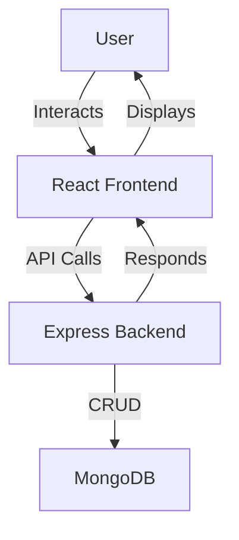

[](https://classroom.github.com/online_ide?assignment_repo_id=19857640&assignment_repo_type=AssignmentRepo)
# Task Manager MERN Application

## Project Overview
A full-stack Task Manager application built with the MERN stack (MongoDB, Express.js, React.js, Node.js). Users can add, view, and delete tasks. The project demonstrates seamless integration between front-end and back-end components, including database operations, API communication, and state management.

---

## Architecture



---

## Setup Instructions

### Prerequisites
- Node.js & npm or pnpm
- MongoDB (local or [MongoDB Atlas](https://www.mongodb.com/atlas))

### 1. Clone the repository
```sh
git clone <your-repo-url>
cd week-4-mern-integration-assignment-Sifa001
```

### 2. Backend Setup
```sh
cd server
cp .env.example .env # Create your .env file if needed
pnpm install # or npm install
```
- Edit `.env` and set your `MONGODB_URI` (local or Atlas)

#### Start the backend:
```sh
pnpm start # or npm start
```

### 3. Frontend Setup
```sh
cd ../client
pnpm install # or npm install
```

#### Start the frontend:
```sh
pnpm run dev
```

### 4. Open the App
- Visit [http://localhost:5173](http://localhost:5173) in your browser.

---

## API Documentation

### Base URL
```
http://localhost:5000/api
```

### Endpoints

#### **Tasks**
- `GET /tasks` — Get all tasks
- `POST /tasks` — Create a new task
  - Body: `{ "title": "Task title" }`
- `DELETE /tasks/:id` — Delete a task by ID

#### Example Request (Create Task)
```http
POST /api/tasks
Content-Type: application/json

{
  "title": "Buy groceries"
}
```

#### Example Response
```json
{
  "_id": "...",
  "title": "Buy groceries",
  "completed": false,
  "createdAt": "...",
  "updatedAt": "..."
}
```

---

## Features Implemented
- Add new tasks
- View all tasks
- Delete tasks
- Responsive UI with React and Tailwind CSS
- RESTful API with Express.js
- MongoDB for persistent storage
- State management with React hooks

---

## Screenshots

### Task Manager UI


---

## License
MIT 